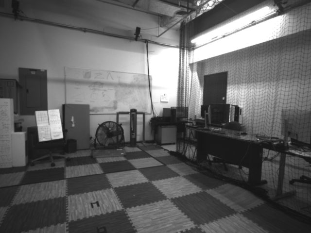
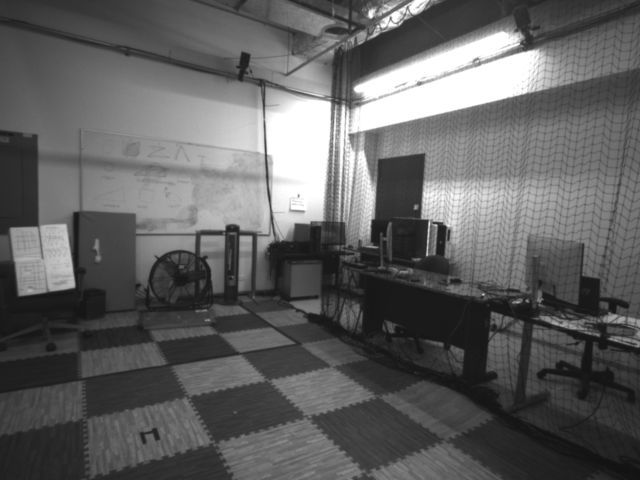
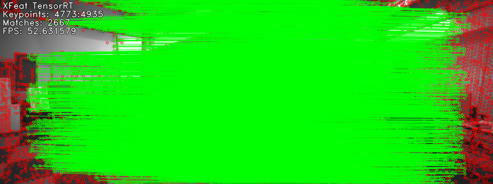
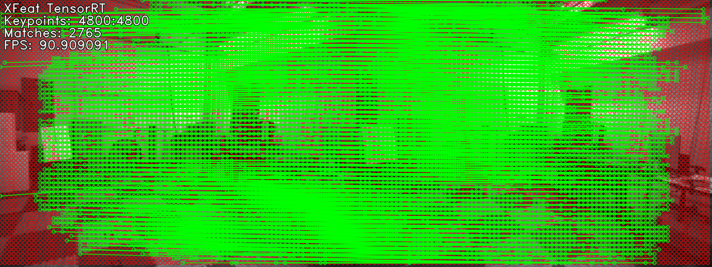

# XFeatTensorRT
A C++ TensorRT implementation of XFeat: Accelerated Features deep learning model for lightweight image matching by VeRLab: https://github.com/verlab/accelerated_features

## Requirements
1) OpenCV 4
2) CUDA 12.2
3) NVIDIA TensorRT 8.6 +
4) LibTorch (PyTorch)
5) yaml-cpp

## How to build and run
#### Step 1. Clone the repository 
  ```
  git clone https://github.com/PranavNedunghat/XFeatTensorRT.git
  ```
#### Step 2. Convert the xfeat.pt file in /weights directory to a TensorRT .engine format and place it in the same directory . **[IamShubhamGupto](https://github.com/verlab/accelerated_features/pull/4)** has made very help scripts to help with this process.

#### Step 3. Modify the CMakeLists.txt file at lines: 23 which basically tell CMake where the LibTorch libraries are located. For example: 
  ```
  find_package(Torch REQUIRED PATHS ${PROJECT_SOURCE_DIR}/libtorch)
  ```
   if you have the LibTorch library or 
  ```
  find_package(Torch REQUIRED PATHS /usr/local/lib/python3.10/dist-packages/torch/share/cmake/Torch)
  ```
   if you have PyTorch installed, which comes with LibTorch.
  
#### Step 4. Create a build directory in the project directory and build the library and executables
  ```
  mkdir build && cd build
  cmake ..
  make
  ```
#### Step 5. The build directory should contain the executables for both sparse and dense feature matching using XFeat. To run the executable:
  ```
  ./xample </path/to/config/file> </path/to/engine/file> <path/to/img1> <path/to/img2> #For the Sparse output
  ./xampleDense </path/to/config/file> </path/to/engine/file> <path/to/img1> <path/to/img2> #For the Dense output
  ```
   For example, in the build directory:
  ```
  ./xample ../config/config.yaml ../weights/xfeat.engine ../example_imgs/Image1.png ../example_imgs/Image2.png #For the Sparse output
  ./xampleDense ../config/config.yaml ../weights/xfeat.engine ../example_imgs/Image1.png ../example_imgs/Image2.png #For the Dense output
  ```
The outputs will be located in the directory where image 1 is located as SparseOutput.png and DenseOutput.png respectively
## Outputs
#### Input Images


#### Sparse Output

#### Dense Output


## Notes about the performance and outputs
1) Please make sure that the CUDA and TensorRT versions match the requirements. For some reason, when the engine file is created using an older TensorRT version, the model will not perform at all and you are likely to run into errors.
2) The above outputs were obtained on an Nvidia Jetson Orin NX 16GB running JetPack 6.0, with CUDA 12.2.140 and TensorRT 8.6.2.3 installed.    

# Acknowledgements
This is a simple C++ implementation of XFeat: Accelerated Features deep learning model for lightweight image matching by VeRLab. If you find this useful please do support their incredible work:
1) **[GitHub](https://github.com/verlab/accelerated_features)**
2) **[Homepage](https://www.verlab.dcc.ufmg.br/descriptors/xfeat_cvpr24/)**
3) **[CVPR Paper](https://openaccess.thecvf.com/content/CVPR2024/html/Potje_XFeat_Accelerated_Features_for_Lightweight_Image_Matching_CVPR_2024_paper.html)**

Thanks also to **[IamShubhamGupto](https://github.com/verlab/accelerated_features/pull/4)** for his excellent work on exporting the model to onnx and the Python TensorRT implementation of XFeat. 
